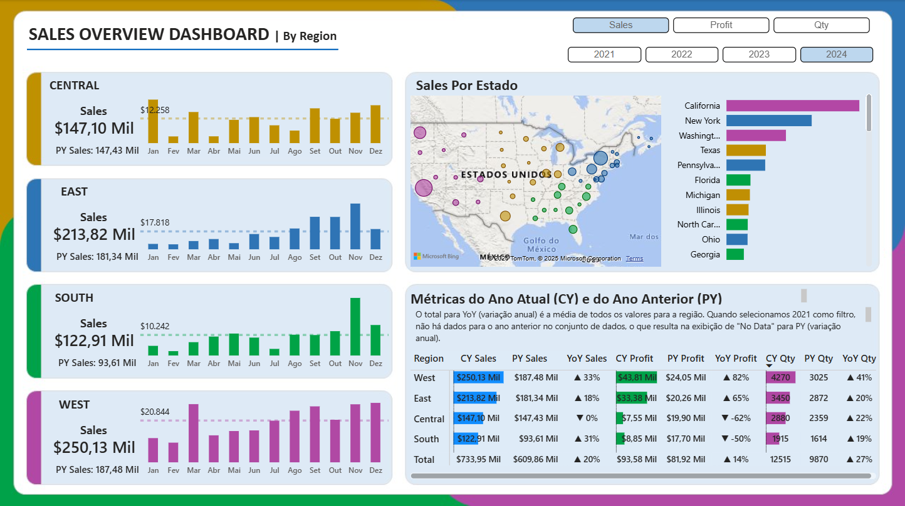

# Análise Estratégica de Vendas e Lucratividade Regional

### 1. Problema de Negócio
A empresa, apesar de manter um volume de vendas constante, identificou inconsistências na margem de lucro final. A diretoria precisava entender por que determinadas regiões, mesmo com atividade comercial ativa, não estavam contribuindo positivamente para o resultado financeiro.

O desafio era sair de relatórios estáticos de vendas e criar uma visão dinâmica que permitisse cruzar Vendas, Lucro e Descontos para identificar vazamentos de receita e oportunidades de ajuste na estratégia de precificação.

### 2. Contexto
A operação cobre quatro grandes regiões (Central, East, South, West) nos Estados Unidos, com um mix de produtos variado. Os dados históricos continham informações granulares de transações, mas faltava inteligência analítica para responder:

- Qual a relação real entre volume vendido e lucro líquido?

- A política de descontos agressivos está gerando volume ou apenas destruindo valor?

- Quais produtos específicos são os "vilões" da performance regional?

- O objetivo foi desenvolver um Dashboard Gerencial para democratizar o acesso a esses dados, permitindo comparações anuais (YoY) e análises de tendência.

### 3. Premissas da Análise
Métricas Chave: Foco total na tríade Vendas (Sales), Lucro (Profit) e Quantidade (Qty).

- Sazonalidade: Comparação "Year over Year" (YoY) para eliminar vieses sazonais.

- Granularidade: A análise desceu do nível macro (Região) até o micro (Sub-categoria de produto).

- Dados: Valores negativos em "Profit" indicam prejuízo real na operação, não apenas custo de oportunidade.

### 4. Estratégia da Solução
Utilizei uma abordagem de BI completa, desde o ETL até a visualização:

- Levantamento de Requisitos: Definição dos KPIs dinâmicos e filtros de visualização (Sales, Profit, Qty).

- ETL e Modelagem: Limpeza dos dados brutos e criação de relacionamentos entre tabelas fato e dimensão.

- Engenharia de Atributos (DAX): Criação de medidas calculadas para Current Year (CY), Previous Year (PY) e variações percentuais (YoY%) para permitir a seleção dinâmica de métricas.

### 5. Ferramentas Utilizadas
- Power BI: Para orquestração da solução, modelagem e visualização.

- DAX (Data Analysis Expressions): Para cálculos de inteligência de tempo e métricas dinâmicas.

- Power Query: Para tratamento e limpeza dos dados.

- PowerPoint: Para prototipagem e design do layout do dashboard.

### 6. Insights da Análise
A análise exploratória revelou padrões críticos que estavam ocultos nas médias gerais:

- Disparidade Regional: Enquanto as regiões West e East performam bem, as regiões Central e South são as ofensoras do resultado, apresentando os menores volumes de vendas e, criticamente as piores margens de lucro.

- O "Vilão" dos Descontos: Aprofundando a análise nessas duas regiões críticas, identificou-se uma correlação direta entre prejuízo e política de descontos. Descontos agressivos (entre 70% e 80%) estão sendo aplicados massivamente sem o retorno esperado em volume.

- Foco do Problema: O problema não é generalizado. Ele está isolado na Categoria "Office Supplies", especificamente nas subcategorias "Appliances" e "Binders". Esses produtos estão sendo vendidos com margens negativas profundas devido aos descontos excessivos nessas regiões.

### 7. Resultados e Ações Recomendadas
Com base nos dados, o projeto forneceu suporte para as seguintes decisões estratégicas:

- Revisão Imediata de Preços: Bloqueio de descontos acima de 30% para "Appliances" e "Binders" nas regiões Central e South.

- Foco Comercial: Redirecionamento da força de vendas dessas regiões para focar em produtos com margem de contribuição positiva, reduzindo a dependência de "Office Supplies" para bater metas de volume.

- Monitoramento Contínuo: Implementação do dashboard para que os gerentes regionais monitorem o impacto da redução de descontos na lucratividade semana a semana.

### 8. Próximos Passos
- Implementar análise de "Cesta de Compras" para entender se esses produtos com prejuízo puxam a venda de produtos lucrativos (cross-sell).

- Criar alertas automáticos no Power BI para quando a margem de uma categoria cair abaixo de um limite aceitável.
